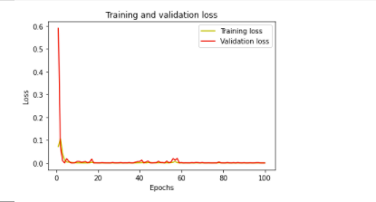

# COVID-19-DATA-PREDICTION
## Using RNN-LSTM

The aim of this project is constructing a Covid-19 Model Prediction for all countries around the world. To be more specific, the model forecast the confirmed cases.

