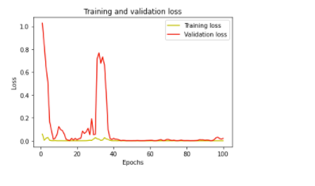

# COVID-19-DATA-PREDICTION
## Using RNN-LSTM (Deep Learning)

The aim of this project is constructing a Covid-19 Model Prediction for all countries around the world. To be more specific, the model forecast the confirmed cases.
With the aforementioned predicted result, we can prepare for the large scale outbreaks and pandemics.

The confirmed cases of the World:

The confirmed cases of VietNam:

